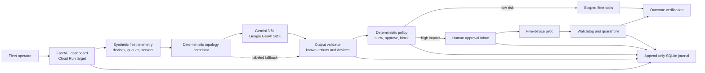

# FleetPilot Architecture

## Trust boundary

Gemini may diagnose and propose an action, but it cannot call fleet operations
directly. Proposals must pass schema and device validation, then the
deterministic policy decides whether a scoped tool may run, a human must
approve, or the action is blocked. Every transition is written to the audit
journal. All fleet data and actions in the contest build are synthetic.
