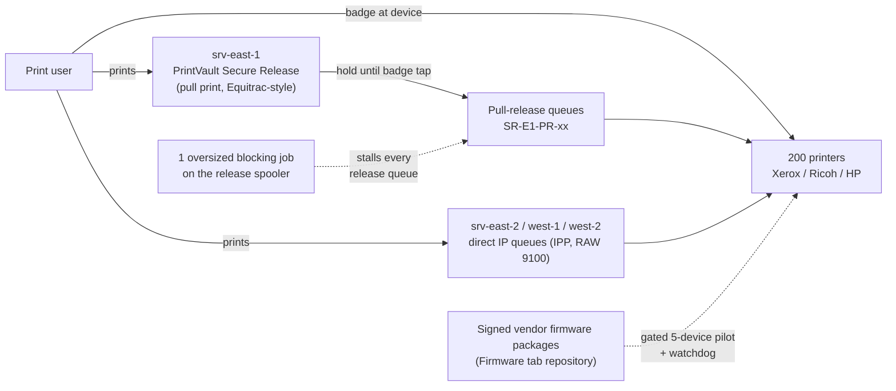

# FleetPilot Architecture

```mermaid
flowchart LR
    Operator["Fleet operator"] --> UI["FastAPI dashboard<br/>deployed on Cloud Run"]
    UI --> Session["Bounded browser-session state<br/>in-process · ephemeral"]
    Session --> Evidence["Synthetic incident evidence<br/>jobs, printers, queues, servers"]
    Evidence --> Correlator["Deterministic topology correlator"]
    Correlator --> Gemini["Vertex AI · Gemini 3.5+<br/>Google GenAI SDK<br/>service-account auth"]

    subgraph Boundary["Gemini / execution trust boundary"]
        Validator["Validate output<br/>allowlisted kinds + known devices"] --> Grounding["Ground incident scope<br/>before policy"]
        Grounding --> Policy["Deterministic policy<br/>auto · human · block"]
    end

    Gemini --> Validator
    Correlator -. "labeled offline/timeout fallback" .-> Validator

    Policy -->|"bounded low risk"| Simulator["Scoped simulator operation"]
    Policy -->|"high impact"| Approval["Human approval inbox"]
    Approval --> Pilot["Five-printer pilot"]
    Pilot --> Watchdog["Watchdog · quarantine · abort"]
    Simulator --> Verify["Re-observe synthetic post-state<br/>targeted + collateral checks"]
    Watchdog --> Verify
    Verify --> UI

    UI --> Journal["SQLite POC journal<br/>ephemeral Cloud Run filesystem"]
    Validator --> Journal
    Policy --> Journal
    Simulator --> Journal
    Approval --> Journal
    Watchdog --> Journal
    Verify --> Journal
```

## Fleet print topology (what the agent operates on)

Why one job stalls 22 queues: pull-print jobs all spool through the release
server's shared spooler before badge release, so a single blocking job there
holds every pull-release queue behind it — while direct-IP queues and the
printers themselves stay healthy. The queue-hang demo is exactly this
failure; the firmware demo pushes signed packages from the repository through
a human-gated pilot with a watchdog.

## Agent and execution architecture

## Trust boundary

Gemini may diagnose and propose an action, but it cannot call fleet operations
directly. Proposals must pass schema/device validation and deterministic scope
grounding before policy decides whether a scoped simulator operation may run,
a human must approve, or the action is blocked. The verifier re-reads simulator
state; it never upgrades that evidence into a physical-device claim. All fleet
data and actions in the contest build are synthetic.

## Shipped POC limits

- The hosted dashboard is unauthenticated. Browser-session state isolates
  visitors within one process, but it is not durable or cross-instance tenancy.
- The SQLite journal is useful for the demo but is not durable on the Cloud Run
  filesystem and is not a production audit store.
- Real vendor APIs, SNMP/HTTPS polling, authenticated operator sessions, a
  durable database, and external outcome confirmation are production adapter
  boundaries—not shipped features.
